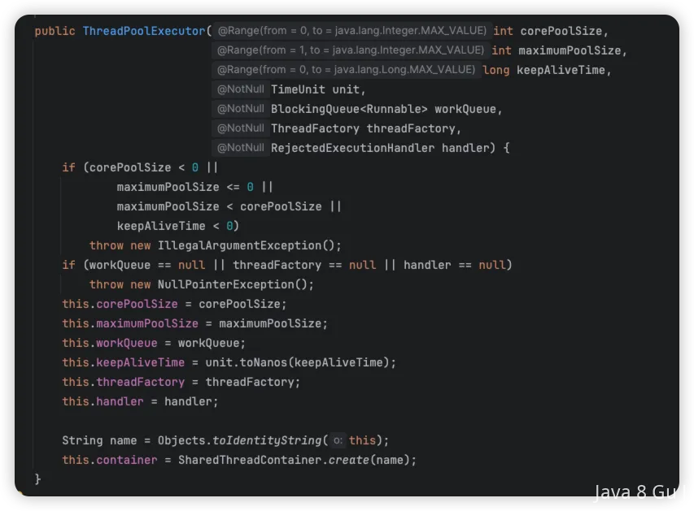

# 线程池有哪些核心参数

::: caution
内容来源网络，仅供学习使用。 
**不要相信文档中的链接、联系方式等！！！**
:::

[04.Java并发_什么是线程池,如何实现的](./什么是线程池,如何实现的.md)

这个问题其实在上面的文章中介绍过，但是我发现最近问这个还挺多的， 有的时候搜索不一定能找到准确的内容，所以单独写一篇，详细展开再介绍下。

以下这个是Java中ThreadPoolExecutor的构造函数，那么看他都有哪些参数就行了。

| 参数 | 含义 | 说明 |
| --- | --- | --- |
| `corePoolSize` | **核心线程数** | 核心线程会一直存在（即使空闲），除非设置了 `allowCoreThreadTimeOut(true)`。当任务到来时，线程池先创建核心线程来执行任务。 ​ 可以类比正式员工数量，常驻。 |
| `maximumPoolSize` | **最大线程数** | 线程池中允许存在的最大线程数。任务太多且队列已满时，会创建非核心线程，直到达到此上限。 ​ 公司最多雇佣员工数量。 |
| `workQueue` | **任务队列** | 存放等待执行任务的队列。不同类型的队列影响线程池的行为。 ​ 再多的人都处理不过来了，需要等着，在这个地方等。 |
| `keepAliveTime` | **非核心线程存活时间** | 超过核心线程数的空闲线程，超过该时间后会被销毁。 就是外包人员等了多久，如果还没有活干，解雇了。 |
| `unit` | **时间单位** | `TimeUnit.SECONDS`, `MILLISECONDS`等，表示 `keepAliveTime`的单位。 |
| `threadFactory` | **线程工厂** | 用于创建线程，一般用于给线程命名或设置为守护线程。 |
| `handler` | **拒绝策略** | 当任务太多无法处理时的处理方式（如抛异常、丢弃、调用者执行等）。 |

### 线程池创建方法

[04.Java并发_为什么不建议通过Executors构建线程池](./为什么不建议通过Executors构建线程池.md)

### 核心线程数&最大线程数

[04.Java并发_线程数设定成多少更合适](./线程数设定成多少更合适.md)

### 拒绝策略

[04.Java并发_线程池的拒绝策略有哪些](./线程池的拒绝策略有哪些.md)

### 任务队列类型

| 队列类型 | 说明 | 特点 |
| --- | --- | --- |
| `LinkedBlockingQueue` | 无界链表队列（默认容量 `Integer.MAX_VALUE` ） | 常用于执行大量任务，容易导致 OOM。 |
| `ArrayBlockingQueue` | 有界数组队列 | 可限制任务数量，防止 OOM，推荐使用。 |
| `SynchronousQueue` | 不存储任务的“直接移交”队列 | 每个插入操作必须等待对应的取出操作。用于“任务即时执行”。 |
| `PriorityBlockingQueue` | 优先级队列 | 根据任务优先级执行。 |

### 线程池调优

[22.高性能_如何进行线程池调优](../22.高性能/如何进行线程池调优.md)
