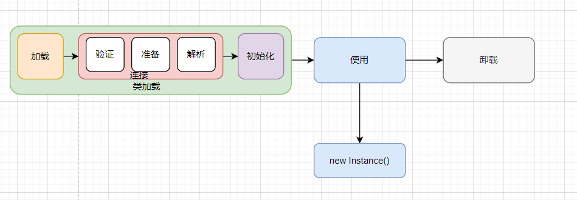

# 类的生命周期是怎么样的

::: caution
内容来源网络，仅供学习使用。 
**不要相信文档中的链接、联系方式等！！！**
:::

一个类从诞生到卸载，大体分为如下几步：

大的阶段可以分为类的加载、类的使用、以及类的卸载。

其中类的加载阶段又分为加载、链接、初始化。其中连接过程又包含了验证、准备和解析。

### 加载阶段

[05.JVM_Java中类加载的过程是怎么样的](./Java中类加载的过程是怎么样的.md)

### 类使用过程

类的使用，即是类在加载完毕后，会有代码段来引用该类，如初始化该类的对象，或者通过反射获取该类的元数据。

### 类卸载过程

假如说该类满足下面2个条件：

1.  该类所有的实例都已被GC回收。
2.  该类的ClassLoader已经被GC回收。

那么该类会在FULLGC期间从方法区被回收掉。

这个时候，我们需要明白一个问题，我们知道，JVM自带的类加载器因为需要一直加载基础对象，所以JDK自带的基础类是一定不会被回收掉的，那么会有哪些类会被回收掉呢？

答案就是那些自定义类加载器一些场景的类会被回收掉，如tomcat，SPI，JSP等临时类，是存活不久的，所以需要来不断回收

##
