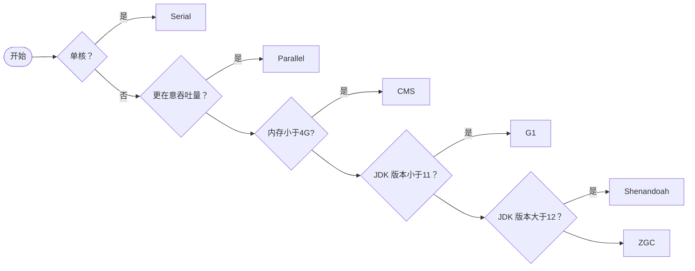
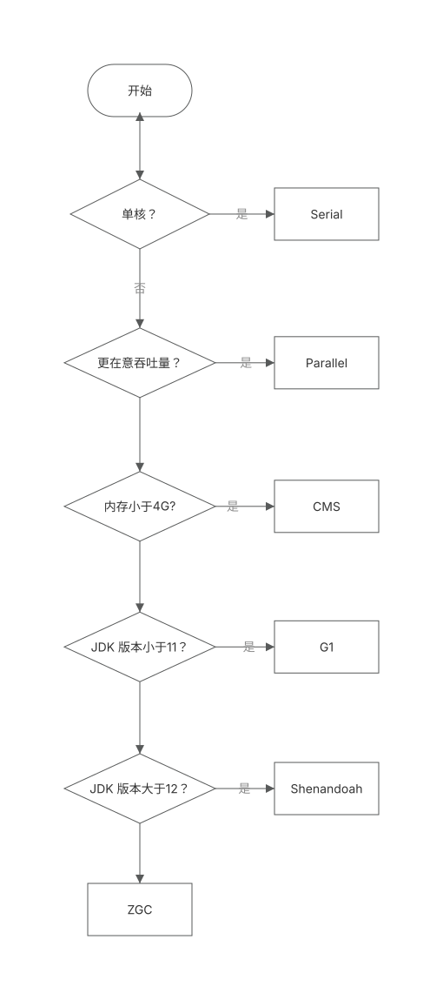

# 项目中如何选择垃圾回收器_为啥选择这个

::: caution
内容来源网络，仅供学习使用。 
**不要相信文档中的链接、联系方式等！！！**
:::

[05.JVM_新生代和老年代的垃圾回收器有何区别](./新生代和老年代的垃圾回收器有何区别.md)

上文中介绍常见的垃圾回收器，其中包括：

1.  串行垃圾回收器（Serial Garbage Collector） 如：Serial GC， Serial Old

-   单线程垃圾收集器，适用于单核机器。
-   暂停时间较长，不适用于多核环境和大内存应用。

2.  并行垃圾回收器（Parallel Garbage Collector） 如：Parallel Scavenge，Parallel Old，ParNew

-   多线程垃圾收集器，适用于多核机器。适合批处理、后台作业等暂停时间不敏感的应用。
-   暂停时间较长，不适合需要低延迟的应用。

3.  并发标记扫描垃圾回收器（CMS Garbage Collector）

-   低延迟垃圾收集器，适合需要响应时间较短、高响应性要求的应用。
-   容易产生碎片，可能需要Full GC进行碎片整理，Full GC时会有较长暂停。

4.  G1垃圾回收器（G1 Garbage Collector，JDK 7中推出，JDK 9中设置为默认）

-   设计用于替代CMS，适合大内存、多核环境。较低的暂停时间，能够预测性地控制暂停时间，适合大数据量应用。

5.  ZGC垃圾回收器（The Z Garbage Collector，JDK 11 推出）、Shenandoah GC（JDK 12 推出）

-   超低延迟垃圾收集器，适用于超大堆内存。暂停时间通常在10ms以下，适合对响应时间有极高要求的应用。
-   目前只支持较新的JDK版本，可能存在一些不成熟的特性。

综上，在进行选择的时候，按照以下步骤：

1、根据机器情况判断，如果是单核机器，或者内存较小的机器，则选择Serial GC。

2、根据业务类型判断，看你的应用更在意的是吞吐量还是 STW 的时长。比如批处理任务的应用，更在意的就是吞吐量，而实时交易系统，更在意的就是 STW 的时长。

3、根据机器分配的堆内存大小进行判断，一把来说，我们认为至少达到4G 以上才可以用 G1、ZGC 等，通常要比如超过8G、16G 这样效果才更好。

4、根据 JDK 版本进行判断，不同的版本支持的垃圾收集器不一样。

可以参考以下的选择方式（但是，并不绝对，尤其是 ZGC 和Shenandoah GC 的选择，其实还是要慎重，毕竟他们的稳定性各方面还有待验证）：

