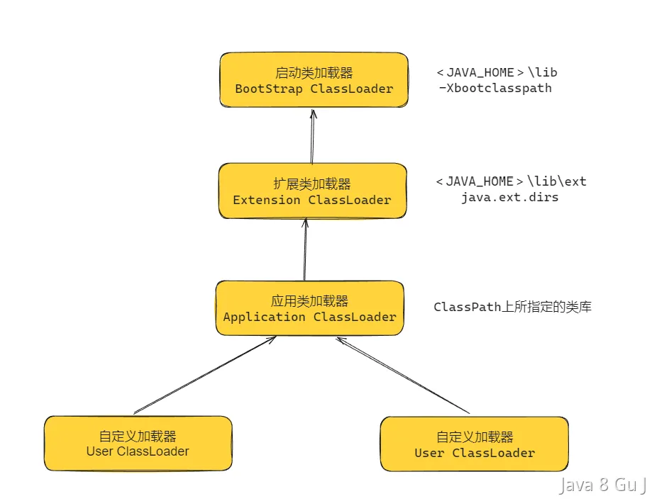
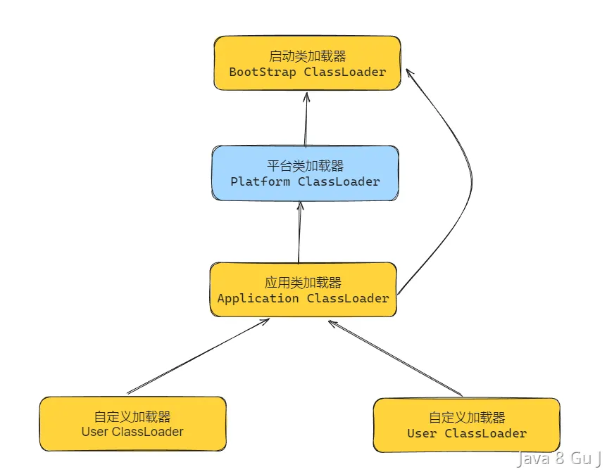

# SpringBoot和传统的双亲委派有什么不一样吗

::: caution
内容来源网络，仅供学习使用。<br/>
**不要相信文档中的链接、联系方式等！！！**
:::

传统的采用双亲委派的类加载机制大家都知道，要加载一个类的额时候，先委托父类加载器加载该类；如果父类加载器无法找到（类不存在），才由当前 `ClassLoader` 加载；这样保证了核心类库（rt.jar）不会被重复加载，避免了类冲突问题。

在JDK 1.8之前，传统的双亲委派如下：

[05.JVM_什么是双亲委派_如何破坏](../05.JVM/什么是双亲委派_如何破坏.md)



在JDK 1.9中，传统的双亲委派如下：

[05.JVM_JDK1.8和1.9中类加载器有哪些不同](../05.JVM/JDK1.8和1.9中类加载器有哪些不同.md)



**Spring Boot 打破了传统的双亲委派模型，采用 自定义的** `**LaunchedURLClassLoader**` **进行类加载，主要为了支持 "Fat JAR"（可执行 JAR） 的运行。**

[30.Maven&Git_什么是fat_jar](../30.Maven&Git/什么是fat_jar.md)

在 Spring Boot 中，使用 Maven 或 Gradle 构建项目时，`lib/` 目录中的第三方依赖是以 JAR 形式打包进主 JAR 内部，默认会生成一个包含所有依赖项的 fat jar。

传统的 `Application ClassLoader` 只能从 **外部** `**classpath**` 加载类，无法直接加载 **JAR 包内嵌的其他 JAR（fat jar）**。 因此 Spring Boot 需要自定义类加载器。

为了支持 **Fat JAR 运行模式**，Spring Boot **使用** `**LaunchedURLClassLoader**` **替代** `**AppClassLoader**`，打破双亲委派机制，核心做法是：

-   **先加载** `**BOOT-INF/classes**` **目录下的应用类**（优先于 JDK 类）。
-   **再加载** `**BOOT-INF/lib/**` **目录下的依赖 JAR**（传统 `AppClassLoader` 无法加载嵌套 JAR）。
-   **最后才交给父类加载器**（即 JDK 提供的 `AppClassLoader`）。

**也就是说Spring Boot 先尝试加载自身的类和依赖 JAR，找不到才交给父类加载器，从而打破双亲委派。**

Talk is Cheap，Show me the Code：

[https://github.com/joansmith/spring-boot/blob/master/spring-boot-tools/spring-boot-loader/src/main/java/org/springframework/boot/loader/LaunchedURLClassLoader.java](https://github.com/joansmith/spring-boot/blob/master/spring-boot-tools/spring-boot-loader/src/main/java/org/springframework/boot/loader/LaunchedURLClassLoader.java)

以下是LaunchedURLClassLoader 的源码：

```plain
@Override
	protected Class<?> loadClass(String name, boolean resolve)
			throws ClassNotFoundException {
		synchronized (LaunchedURLClassLoader.LOCK_PROVIDER.getLock(this, name)) {
			Class<?> loadedClass = findLoadedClass(name);
			if (loadedClass == null) {
				Handler.setUseFastConnectionExceptions(true);
				try {
					loadedClass = doLoadClass(name);
				}
				finally {
					Handler.setUseFastConnectionExceptions(false);
				}
			}
			if (resolve) {
				resolveClass(loadedClass);
			}
			return loadedClass;
		}
	}

	private Class<?> doLoadClass(String name) throws ClassNotFoundException {

		// 1) Try the root class loader
		try {
			if (this.rootClassLoader != null) {
				return this.rootClassLoader.loadClass(name);
			}
		}
		catch (Exception ex) {
			// Ignore and continue
		}

		// 2) Try to find locally
		try {
			findPackage(name);
			Class<?> cls = findClass(name);
			return cls;
		}
		catch (Exception ex) {
			// Ignore and continue
		}

		// 3) Use standard loading
		return super.loadClass(name, false);
	}
```

**可以看到，在loadClass方法中，主要调用doLoadClass，仔细看doLoadClass的第37行，和第45行，可以看到，先执行37行的findClass，然后再执行45行的super.loadClass，这就意味着，他会先自己加载，然后加载不到再委托给父加载器加载的。**
