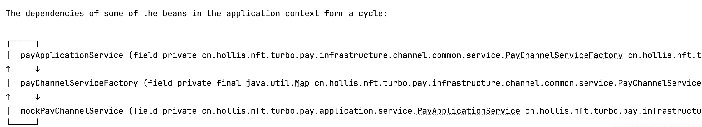

# Spring默认支持循环依赖吗_如果发生如何解决

::: caution
内容来源网络，仅供学习使用。<br/>
**不要相信文档中的链接、联系方式等！！！**
:::

默认支不支持要看版本，在SpringBoot 2.6以前，是默认支持的，但是在 SpringBoot 2.6 开始，默认已经不开启对循环依赖的支持了。

在SpringBoot 2.6及以后版本中，如果代码中出现Spring的Bean的循环依赖，启动会报错，如以下是我的[数藏项目](https://www.yuque.com/hollis666/vzy8n3/dgolk0cckpb94sia)中关于出现循环依赖时的报错：



提示是有一个循环依赖的问题，即 PayApplicationService -> PayChannelServiceFactory -> MockPayChannelService -> PayApplicationService

也就是说，**Spring虽然引入了三级缓存来解决循环依赖，但是Spring依然认为循环依赖时不合理的，所以他默认关闭了对循环依赖的支持。**

[06.Spring_三级缓存是如何解决循环依赖的问题的](./三级缓存是如何解决循环依赖的问题的.md)

如果想要开启对循环依赖的支持，有以下几种办法：

1、在配置文件中加入`spring.main.allow-circular-references=true`

2、用`@Lazy` 注解，在`@Autowired` 地方增加即可。

```java
@Autowired
@Lazy
private PayChannelServiceFactory payChannelServiceFactory;
```

[06.Spring_@Lazy注解能解决循环依赖吗](./@Lazy注解能解决循环依赖吗.md)
