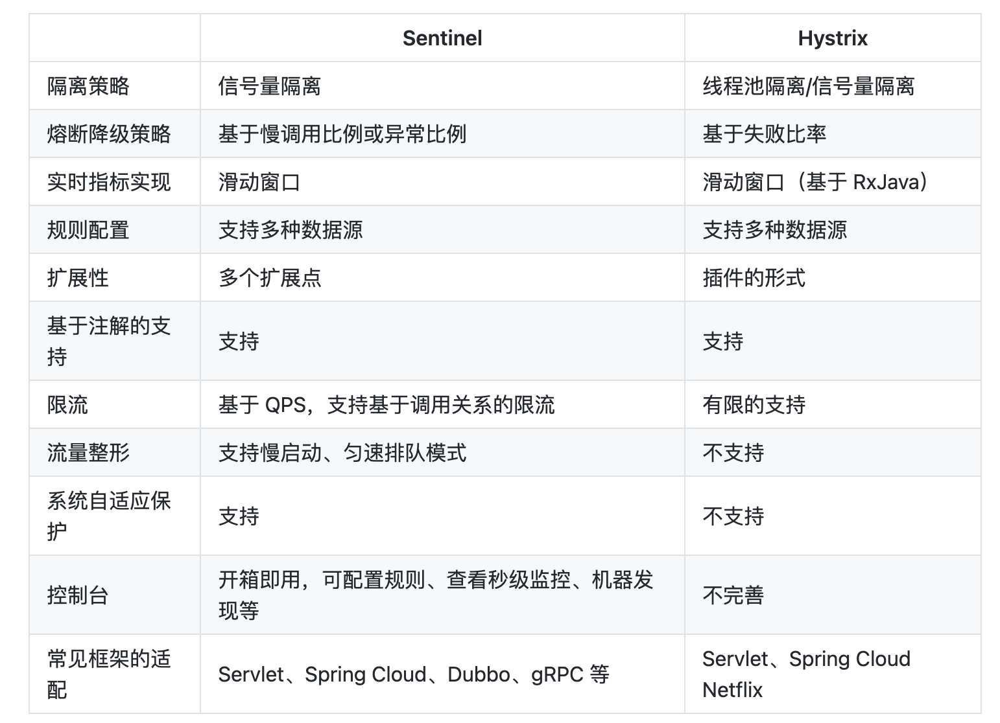

# Hystrix和Sentinel的区别是什么

::: caution
内容来源网络，仅供学习使用。 
**不要相信文档中的链接、联系方式等！！！**
:::

Hystrix和Sentinel都是SpringCloud中可以用来做限流、降级的组件。

Hystrix 的关注点在于以 隔离 和 熔断 为主的容错机制，超时或被熔断的调用将会快速失败，并可以提供 fallback 机制。而 Sentinel 的侧重点在于多样化的流量控制、熔断降级、系统负载保护以及实时监控和控制台。

关于Hystrix和Sentinel的对比，在Sentinel的官网上有一篇文章写的挺详细的： [https://sentinelguard.io/zh-cn/blog/sentinel-vs-hystrix.html](https://sentinelguard.io/zh-cn/blog/sentinel-vs-hystrix.html)

二者的主要差异如下表：

