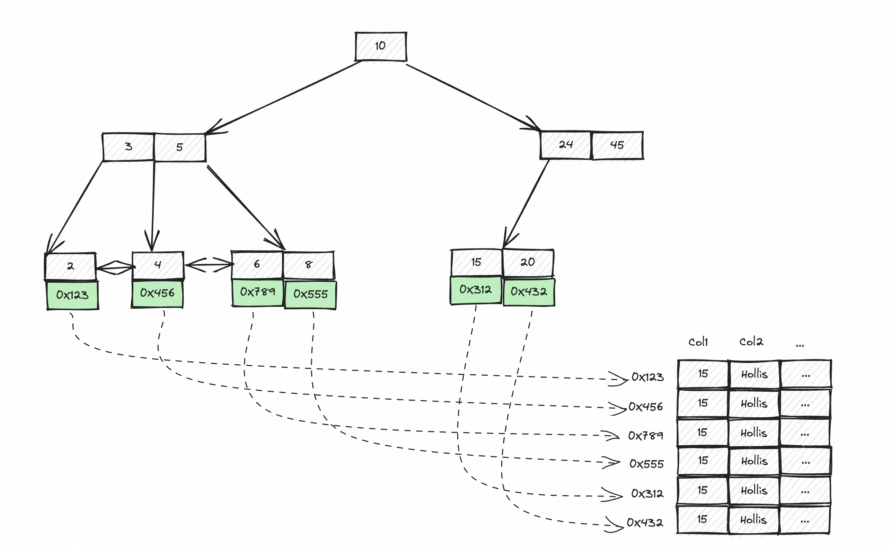

# MyISAM_的索引结构是怎么样的,它存在的问题是什么

::: caution
内容来源网络，仅供学习使用。 
**不要相信文档中的链接、联系方式等！！！**
:::

和InnoDB最大的不同，MyISAM是采用了一种索引和数据分离的存储方式，也就是说，MyISAM中索引文件和数据文件是独立的。

因为文件独立，所以在MyISAM的索引树中，叶子节点上存储的并不是数据，而是数据所在的地址。所以，MyISAM 存储引擎实际上不支持聚簇索引的概念。在 MyISAM 中，所有索引都是非聚簇索引。

[08.MySQL_什么是聚簇索引和非聚簇索引](./什么是聚簇索引和非聚簇索引.md)

也就是说，在MyISAM中，根据索引查询的过程中，必然需要先查到数据所在的地址，然后再查询真正的数据，那么就需要有两次查询的过程。而在InnoDB中，如果基于聚簇索引查询，则不需要回表，因为叶子节点上就已经包含数据的内容了。

因为MyISAM是先出的，正式因为存在这个问题，所以后来的InnoDB 引入了聚簇索引的概念提高了数据检索的效率，特别是对于主键检索。
