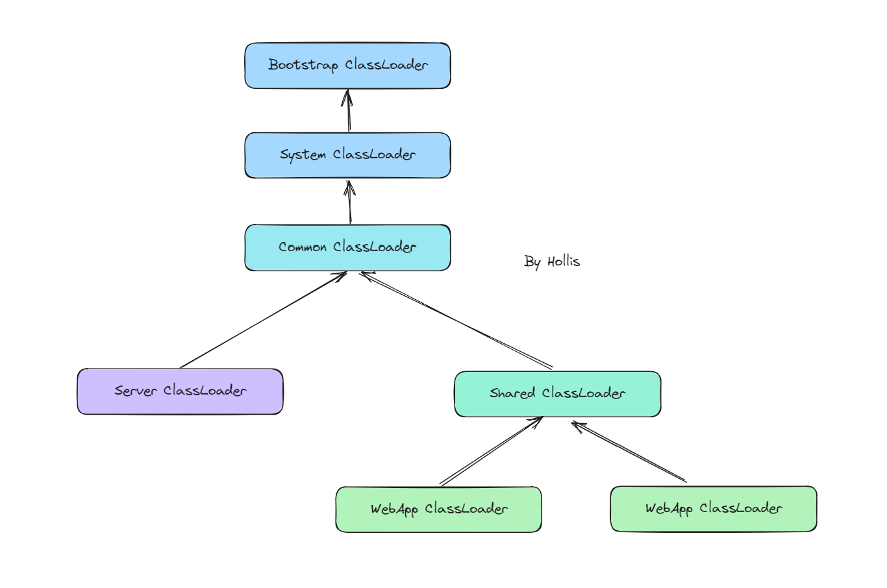
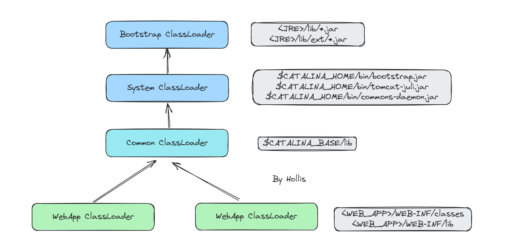

# Tomcat中有哪些类加载器

::: caution
内容来源网络，仅供学习使用。 
**不要相信文档中的链接、联系方式等！！！**
:::

Tomcat的类加载机制是指Tomcat在运行时如何加载和管理Java类。Tomcat的类加载机制的实现并没有严格遵守双亲委派原则，而是采用了一种层次化的类加载器结构，这种结构旨在提供更好的隔离性和灵活性，以支持多个Web应用程序的部署和运行。

[05.JVM_什么是双亲委派_如何破坏](../05.JVM/什么是双亲委派_如何破坏.md#jVIic)

关于Tomcat的ClassLoader的关系，网上有各种各样的图，但是大部分都是不对的。甚至有一些画完图之后竟然还能自圆其说。。。

下面这张图，是我基于Tomcat官网，以及源码总结之后的一张图（从Tomcat 6到Tomcat 10，都长这个样）：

但是，默认情况下，**Server类加载器和Shared类加载器是未定义的**，需要通过在conf/catalina.properties中定义server.loader和/或shared.loader属性的值，才会是这个更复杂的层次结构。

Server类加载器只对Tomcat内部可见，对于Web应用程序完全不可见。

Shared类加载器对所有Web应用程序可见，可以用于在所有Web应用程序之间共享代码。但是，对这些共享代码进行更新将需要重新启动Tomcat。

所以，真正的需要一定有的，并且我们通常需要关注的就是下面这个层级关系：

**启动类加载器（Bootstrap ClassLoader）**： 负责加载JVM自身的核心类库（如java.lang、java.util等）和JVM相关的类。启动类加载器是JVM的一部分，负责加载JVM运行所需的基础类。主要加载JRE中的lib包及lib/ext包下的内容

**系统类加载器（System Class Loader）**，负载加载Tomcat内部的一些核心类库，这些类一般在$CATALINA\_HOME/bin这个目录下， 一般包含bootstarap.jar、tomcat-juli.jar以及common-daemon.jar等。

**公共类加载器（Common Class Loader）**： 负责加载Tomcat的公共类和库，位于$CATALINA\_HOME/lib目录下的JAR文件。这些类库是Tomcat启动时加载的，是整个Tomcat实例中共享的类。

**Web应用程序类加载器（Webapp Class Loader**）： 每个Web应用程序都有一个独立的Web应用程序类加载器，负责加载该Web应用程序的类和资源。它从$CATALINA\_HOME/webapps/`<webapp\_name>`/WEB-INF/classes目录和$CATALINA\_HOME/webapps/`<webapp\_name>`/WEB-INF/lib目录加载类和JAR文件。

# 扩展知识

## Tomcat类加载机制

[10.Tomcat_Tomcat的类加载机制是怎么样的](./Tomcat的类加载机制是怎么样的.md)
