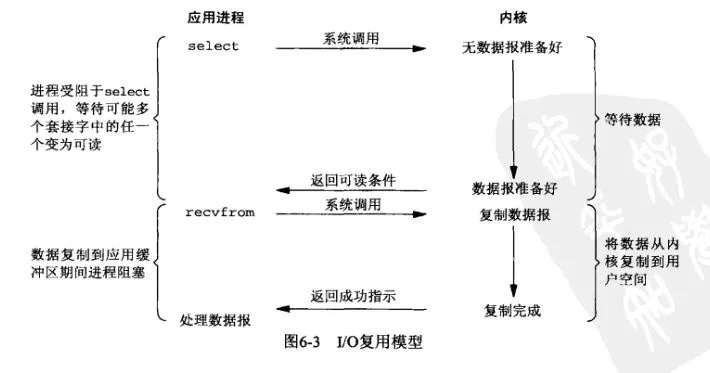
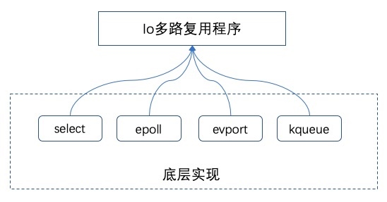
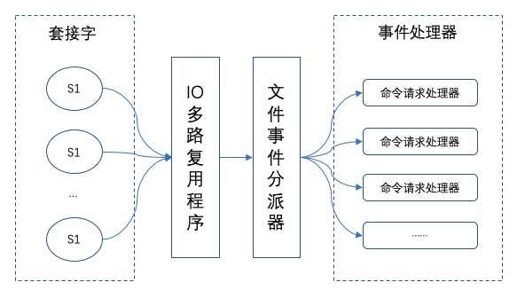

# 为什么Redis设计成单线程也能这么快

::: caution
内容来源网络，仅供学习使用。 
**不要相信文档中的链接、联系方式等！！！**
:::

Redis的性能很好，除了因为他基于内存、有高效的数据结构等等原因以外，还有一个重要的原因那就是他在单线程中使用多路复用 I/O技术也能提升Redis的I/O利用率。

[14.Redis_Redis为什么这么快](./Redis为什么这么快.md)

### Redis的多路复用

多路复用这个词，相信很多人都不陌生。那么，Redis的多路复用技术有什么特别的呢？

这里先讲讲**Linux多路复用技术，就是多个进程的IO可以注册到同一个管道上，这个管道会统一和内核进行交互。当管道中的某一个请求需要的数据准备好之后，进程再把对应的数据拷贝到用户空间中。**

​

多看一遍上面这张图和上面那句话，后面可能还会用得到。

也就是说，通过一个线程来处理多个IO流。

IO多路复用在Linux下包括了三种，select、poll、epoll，抽象来看，他们功能是类似的，但具体细节各有不同。

其实，Redis的IO多路复用程序的所有功能都是通过包装操作系统的IO多路复用函数库来实现的。每个IO多路复用函数库在Redis源码中都有对应的一个单独的文件。



在Redis 中，每当一个套接字准备好执行连接应答、写入、读取、关闭等操作时，就会产生一个文件事件。因为一个服务器通常会连接多个套接字，所以多个文件事件有可能会并发地出现。



一旦有请求到达，就会交给 Redis 线程处理，这就实现了一个 Redis 线程处理多个 IO 流的效果。

所以，Redis选择使用多路复用IO技术来提升I/O利用率。

而之所以Redis能够有这么高的性能，不仅仅和采用多路复用技术和单线程有关，此外还有以下几个原因：

-   1、完全基于内存，绝大部分请求是纯粹的内存操作，非常快速。
-   2、数据结构简单，对数据操作也简单，如哈希表、跳表都有很高的性能。
-   3、采用单线程，避免了不必要的上下文切换和竞争条件，也不存在多进程或者多线程导致的切换而消耗 CPU
-   4、使用多路I/O复用模型
