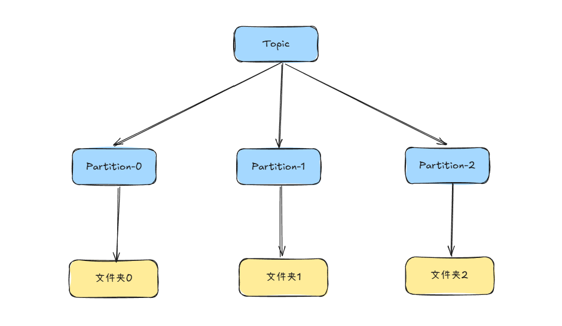
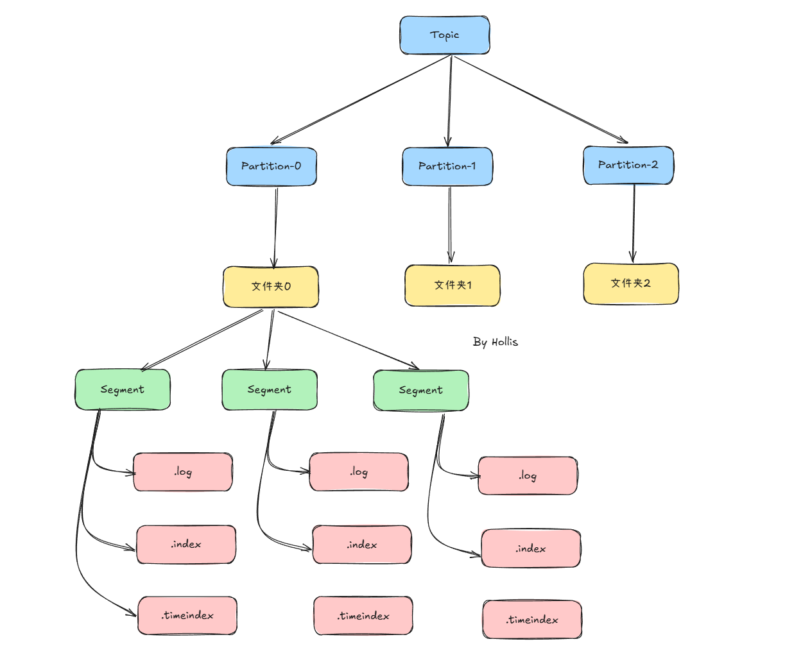

# 介绍下Kafka的数据存储结构

::: caution
内容来源网络，仅供学习使用。<br/>
**不要相信文档中的链接、联系方式等！！！**
:::

Kafka 的存储理念非常简洁：**它将所有收到的消息简单地以顺序追加（Append-Only）的方式写入磁盘文件。** 这种利用**顺序磁盘 I/O** 的方式，这也是kafka性能好的重要原因之一。

[16.Kafka_Kafka_为什么这么快](./Kafka_为什么这么快.md)

Kafka 的存储结构是一个从逻辑概念到物理文件的层级映射关系：

**逻辑概念：**`**Topic**` **\->** `**Partition**`  
**物理文件：**`**Partition**` **\->** `**Log Segment**` **文件**

1.  **Topic**：逻辑上的消息分类，相当于消息队列的名字
2.  **Partition**： Topic 下会划分多个分区，每个分区对应一个有序、不可变的消息队列。这是 Kafka **并行处理**和**水平扩展**的基础。

-   在物理上，**每个 Partition 对应磁盘上的一个文件夹**。

```plain
/tmp/kafka-logs/
├── my-topic-0/           # Partition 0 对应的文件夹
├── my-topic-1/           # Partition 1 对应的文件夹
├── my-topic-2/           # Partition 2 对应的文件夹
└── ...
```



### Segment

虽然每个 Partition 是一个逻辑上的日志，但物理上它并不会被存储为一个巨大的文件，而是被**切割成多个大小相等的 Segment 文件**。**便于过期数据的删除、提升查找效率。**

每个 segment 包含两类文件（同名不同后缀）：

1.  日志数据文件（.log）

-   存储消息本体，采用顺序写，性能极高（磁盘顺序写接近内存速度）。
-   文件名是该 segment 第一条消息的 offset，比如：

```plain
/tmp/kafka-logs/
├── my-topic-0/           # Partition 0 对应的文件夹
│   ├── 00000000000000000000.log
│   └── leader-epoch-checkpoint
├── my-topic-1/           # Partition 1 对应的文件夹
│   ├── 00000000000000000000.log
└── ...
```

2.  索引文件（.index / .timeindex）

-   `.index`：offset 索引，存储相对 offset 与物理位置的映射。
-   `.timeindex`：时间索引，存储消息时间戳与物理位置的映射。
-   便于快速查找消息位置。

```plain
/tmp/kafka-logs/
├── my-topic-0/           # Partition 0 对应的文件夹
│   ├── 00000000000000000000.index
│   ├── 00000000000000000000.log
│   ├── 00000000000000000000.timeindex
│   ├── 00000000000000000005.index
│   ├── 00000000000000000005.log
│   ├── 00000000000000000005.timeindex
│   └── leader-epoch-checkpoint
├── my-topic-1/           # Partition 1 对应的文件夹
│   ├── 00000000000000000000.index
│   ├── 00000000000000000000.log
│   ├── ...
│   └── leader-epoch-checkpoint
└── ...
```

> `**leader-epoch-checkpoint**`：用于存储 Leader Epoch 信息，主要用于防止数据丢失和保证数据一致性，与事务和副本同步相关。

### 整体结构

了解了上面的内容之后，就可以画出一张Kafka的数据存储的结构图了：



### 消息的写入与读取流程

#### 写入（生产者）

1.  生产者发送消息到指定 Topic 的 Partition。
2.  Broker 接收到消息后，将其**顺序追加**到该 Partition 当前活跃的 Segment（即最新的那个 `**.log**` 文件）的末尾。
3.  只有当消息被写入磁盘（根据配置，可以是刷盘也可以是 PageCache）后，这次写入才被认为是成功的。

#### 读取（消费者）

1.  消费者指定要消费的 Topic、Partition 以及 Offset。
2.  Broker 根据 Offset 找到对应的 Segment 文件（通过文件名快速定位）。
3.  使用该 Segment 的 `**.index**` 文件，快速定位到该 Offset 在 `**.log**` 文件中的大致物理位置。
4.  从该物理位置开始，在 `**.log**` 文件中进行顺序扫描，直到找到精确的消息。
5.  将消息发送给消费者。
