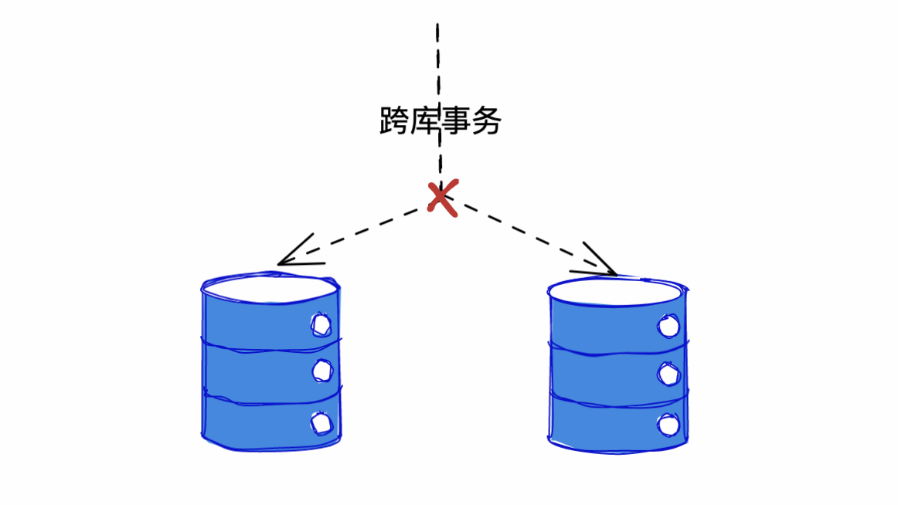

# 分库分表后会带来哪些问题

::: caution
内容来源网络，仅供学习使用。 
**不要相信文档中的链接、联系方式等！！！**
:::

分库分表之后，会带来很多问题。

首先，做了分库分表之后，所有的读和写操作，都需要带着分表字段，这样才能知道具体去哪个库、哪张表中去查询数据。如果不带的话，就得支持全表扫描。

但是，单表的时候全表扫描比较容易，但是做了分库分表之后，就没办法做扫表的操作了，如果要扫表的话就要把所有的物理表都要扫一遍。

还有，一旦我们要从多个数据库中查询或者写入数据，就有很多事情都不能做了，比如**跨库事务就是不支持的。**

所以，分库分表之后就会带来因为不支持事务而导致的数据一致性的问题。

[13.分布式_常见的分布式事务有哪些](../13.分布式/常见的分布式事务有哪些.md)

其次，**做了分库分表之后，以前单表中很方便的分页查询、排序等等操作就都失效了。因为我们不能跨多表进行分页、排序。**

[26.分库分表_分库分表后如何进行分页查询](./分库分表后如何进行分页查询.md)

除此之外，还有一些其他的问题，比如**二次分表的问题，一致性ID的问题**等等。

[26.分库分表_分库分表后,表还不够怎么办](./分库分表后,表还不够怎么办.md)

二次分表的问题可以用一致性哈希解决：

[13.分布式_什么是一致性哈希](../13.分布式/什么是一致性哈希.md)

分布式ID可以参考：

[13.分布式_分布式ID生成方案都有哪些](../13.分布式/分布式ID生成方案都有哪些.md)
