# RocketMQ消费堆积问题排查

::: caution
内容来源网络，仅供学习使用。<br/>
**不要相信文档中的链接、联系方式等！！！**
:::

## 问题现象

负责的业务中有一个应用因为特殊原因，需要修改消息配置（将Spring Cloud Stream 改为 RocketMQ native），修改前和修改后的配置项如下：

```properties
spring.cloud.stream.bindings.consumerA.group=CID_CONSUMER_A
spring.cloud.stream.bindings.consumerA.contentType=text/plain
spring.cloud.stream.bindings.consumerA.destination=CONSUMER_A_TOPIC
spring.cloud.stream.rocketmq.bindings.consumerA.consumer.tags=CONSUMER_A_TOPIC_TAG

spring.cloud.stream.bindings.consumerB.group=CID_CONSUMER_A
spring.cloud.stream.bindings.consumerB.contentType=text/plain
spring.cloud.stream.bindings.consumerB.destination=CONSUMER_B_TOPIC
spring.cloud.stream.rocketmq.bindings.consumerB.consumer.tags=CONSUMER_B_TOPIC_TAG

spring.cloud.stream.bindings.consumerC.group=CID_CONSUMER_A
spring.cloud.stream.bindings.consumerC.contentType=text/plain
spring.cloud.stream.bindings.consumerC.destination=CONSUMER_C_TOPIC
spring.cloud.stream.rocketmq.bindings.consumerC.consumer.tags=CONSUMER_C_TOPIC_TAG
```
```properties
spring.rocketmq.consumers[0].consumer-group=CID_CONSUMER_A
spring.rocketmq.consumers[0].topic=CONSUMER_A_TOPIC
spring.rocketmq.consumers[0].sub-expression=CONSUMER_A_TOPIC_TAG
spring.rocketmq.consumers[0].message-listener-ref=consumerAListener

spring.cloud.stream.bindings.consumerB.group=CID_CONSUMER_A
spring.cloud.stream.bindings.consumerB.contentType=text/plain
spring.cloud.stream.bindings.consumerB.destination=CONSUMER_B_TOPIC
spring.cloud.stream.rocketmq.bindings.consumerB.consumer.tags=CONSUMER_B_TOPIC_TAG

spring.cloud.stream.bindings.consumerC.group=CID_CONSUMER_A
spring.cloud.stream.bindings.consumerC.contentType=text/plain
spring.cloud.stream.bindings.consumerC.destination=CONSUMER_C_TOPIC
spring.cloud.stream.rocketmq.bindings.consumerC.consumer.tags=CONSUMER_C_TOPIC_TAG
```

但是当机器发布一半后开始灰度观察的时候，出现了消息堆积问题：

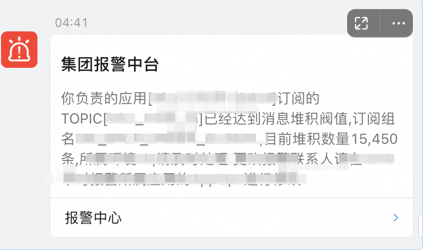

## 问题原因

### 消息订阅关系不一致

经过历史经验和踩坑，感觉有可能是订阅组机器订阅关系不一致导致的消息堆积问题（因为订阅组的机器有的订阅关系是A，有的是B，MQ不能确定是否要消费，就能只能先堆积到broker中），查看MQ控制台后发现，确实是消息订阅关系不一致，导致消息堆积  
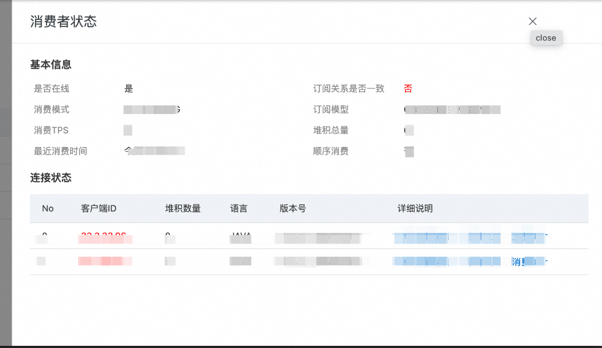

已经发布的那台订阅如下：

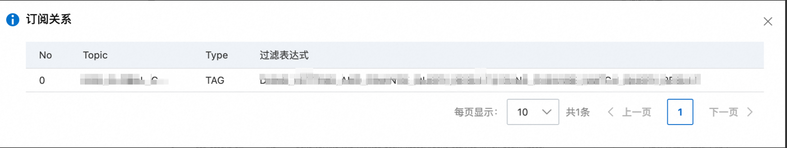

未发布的订阅关系如下（明显多于已经发布的机器的订阅关系）

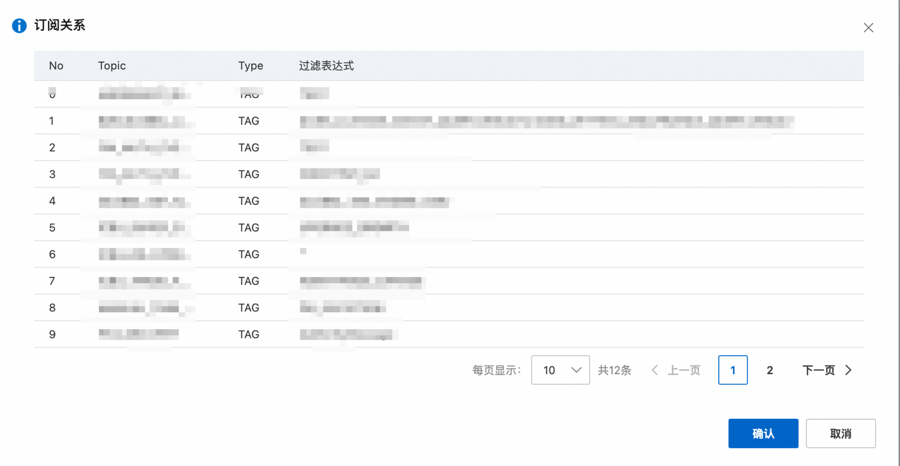

### Spring Cloud Stream 和 RocketMQ Native

所以就引申出了一个问题，为什么将Spring Cloud Stream修改为原生的MetaQ之后，同一个ConsumerId对应的订阅关系就会改变呢？

更简单来说，就是为什么当RocketMQ和Spring Cloud Stream 使用相同的ConsumerId之后，RocketMQ的订阅关系会把Spring Cloud Stream的订阅关系给冲掉呢？

> 注意，一个consumerId是可以订阅多个topic的

这个时候就只能翻Spring Cloud Stream 和 RocketMQ 的启动源码来解答疑惑。

#### RocketMQ

RocketMQ client的类图如下：

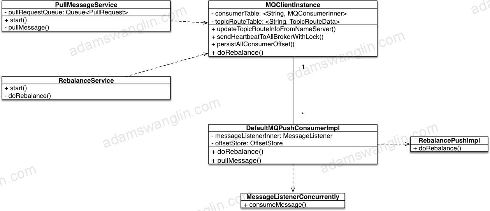

-   MQConsumerInner：记录当前consumerGroup和服务端的交互方式，以及topic和tag的映射关系。默认的实现是DefaultMQPushConsumerImpl，和consumerGroup的对应关系是1 : 1
-   MQClientInstance：统一管理网络链接等可以复用的对象，通过Map维护了ConsumerGroupId和MQConsumerInner的映射关系。简单来说，就是一个ConsumerGroup，只能对应一个MQConsumerInner，如下代码所示：

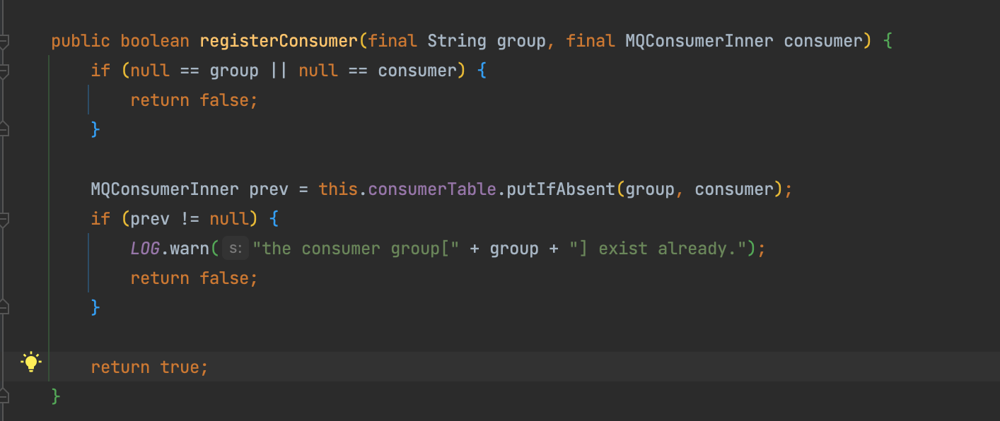

#### Spring Cloud Stream

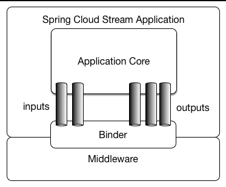

Spring Cloud Stream是连接Spring和中间件的一个胶水层，在Spring Cloud Stream启动的时候，也会注册一个ConsumerGourp，如下代码所示：

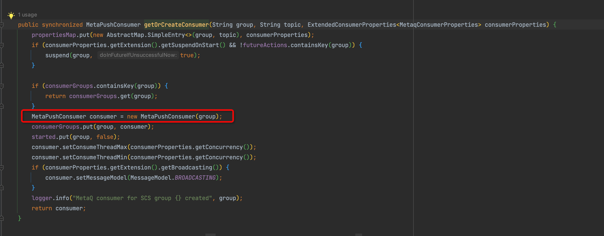

### 问题根因

分析到这里，原因就已经很明显了。Spring Cloud Stream会在启动的时候自己new一个MetaPushConsumer（事实上就是一个新的MQConsumerInner），所以对于一个ConsumerGroup来说，就存在了两个MQConsumerInner，这显然是不符合RocketMQ要求的1:1的映射关系的，所以RocketMQ默认会用新的映射代替老的映射关系。显然，Spring Cloud Stream的被RocketMQ原生的给替代掉了。

这也就是为什么已经发布的机器中，对于ConsumerA来说，只剩下RocketMQ原生的那组订阅关系了

## 解决思路

修改consumerId

```properties
spring.rocketmq.consumers[0].consumer-group=CID_CONSUMER_A
spring.rocketmq.consumers[0].topic=CONSUMER_A_TOPIC
spring.rocketmq.consumers[0].sub-expression=CONSUMER_A_TOPIC_TAG
spring.rocketmq.consumers[0].message-listener-ref=consumerAListener

spring.cloud.stream.bindings.consumerB.group=CID_CONSUMER_B
spring.cloud.stream.bindings.consumerB.contentType=text/plain
spring.cloud.stream.bindings.consumerB.destination=CONSUMER_B_TOPIC
spring.cloud.stream.rocketmq.bindings.consumerB.consumer.tags=CONSUMER_B_TOPIC_TAG

spring.cloud.stream.bindings.consumerC.group=CID_CONSUMER_B
spring.cloud.stream.bindings.consumerC.contentType=text/plain
spring.cloud.stream.bindings.consumerC.destination=CONSUMER_C_TOPIC
spring.cloud.stream.rocketmq.bindings.consumerC.consumer.tags=CONSUMER_C_TOPIC_TAG
```

## 思考和总结

1.  问题原因并不复杂，但是很多人可能分析到第一层（订阅关系不一致导致消费堆积）就不会再往下分析了，但是我们还需要有更深入的探索精神的
2.  生产环境中尽量不要搞两套配置项，会额外增加理解成本。。。。

## 小技巧

### 中间件代码如何确定版本

arthas中的sc 命令

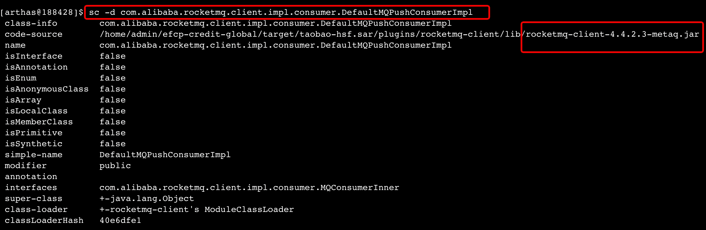

### Idea如何debug具体版本的中间件

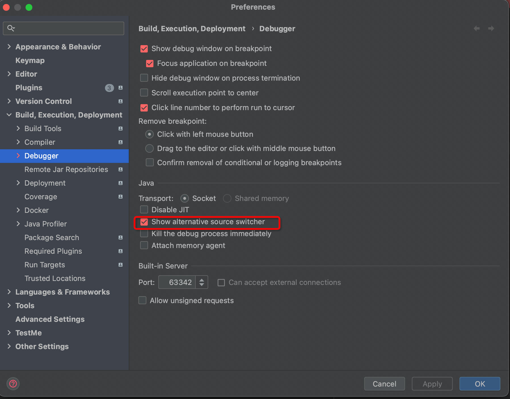

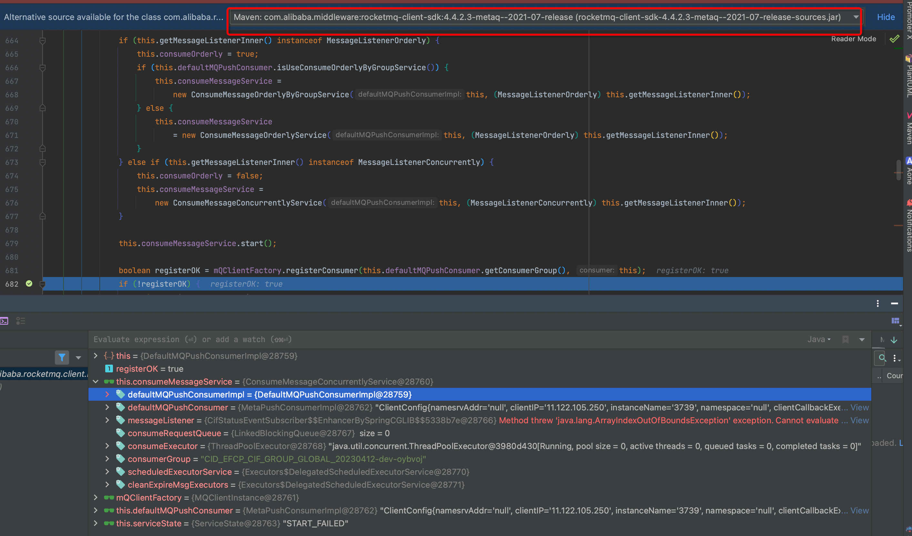
