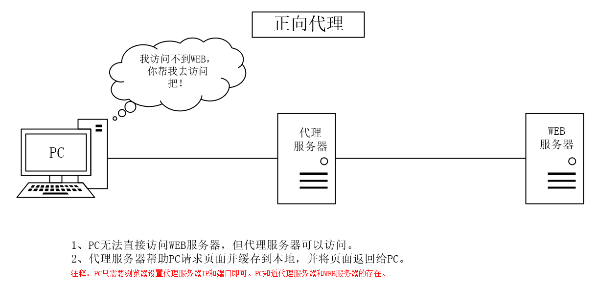

# 什么是“墙”_“梯子”的原理是什么

::: caution
内容来源网络，仅供学习使用。 
**不要相信文档中的链接、联系方式等！！！**
:::

“墙”在这里指的是一种网络屏蔽机制，它通过对互联网流量进行控制，阻止用户访问特定的外部网站或服务。

“墙”一般通过以下几种方式屏蔽和干扰网络流量：

-   IP封锁：屏蔽某些IP地址或服务器，使得用户无法访问相关的网络资源。
-   DNS污染：通过改变域名解析结果，导致用户访问特定网站时无法正确找到目标服务器。

[38.网络安全_什么是DNS污染_DNS劫持](../38.网络安全/什么是DNS污染_DNS劫持.md)

DNS污染是指当一个DNS服务器被恶意修改或替换，导致该服务器不再返回正确的DNS记录，而是返回错误的记录，从而将用户错误地导向到恶意站点。

**梯子**是啥不用介绍了，梯子的实现方式主要是正向代理。

[37.计算机网络_什么是正向代理和反向代理](./什么是正向代理和反向代理.md)

有时候，用户想要访问某国外网站，该网站无法在国内直接访问，但是我们可以访问到一个代理服务器，这个代理服务器可以访问到这个国外网站。这样呢，用户对该国外网站的访问就需要通过代理服务器来转发请求，并且该代理服务器也会将请求的响应再返回给用户。这个上网的过程就是用到了正向代理。

**所以，正向代理，其实是”代理服务器”代理了”客户端”，去和”目标服务器”进行交互。**

通过正向代理服务器访问目标服务器，目标服务器是不知道真正的客户端是谁的，甚至不知道访问自己的是一个代理。
