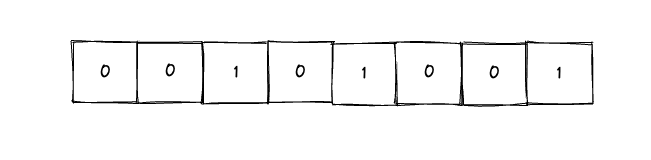
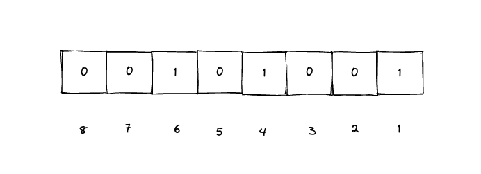

# 什么是BitMap_有什么用

::: caution
内容来源网络，仅供学习使用。 
**不要相信文档中的链接、联系方式等！！！**
:::

位图（BitMap），基本思想就是用一个bit来标记元素，bit是计算机中最小的单位，也就是我们常说的计算机中的0和1，这种就是用一个位来表示的。

所谓位图，其实就是一个bit数组，即每一个位置都是一个bit，其中的取值可以是0或者1

像上面的这个位图，可以用来表示1，,4，6：

如果不用位图的话，我们想要记录1，4，,6 这三个整型的话，就需要用三个unsigned int，已知每个unsigned int占4个字节，那么就是3\*4 = 12个字节，一个字节有8 bit，那么就是 12\*8 = 96 个bit。

所以，**位图最大的好处就是节省空间。**

位图有很多种用途，特别适合用在去重、排序等场景中，著名的布隆过滤器就是基于位图实现的。

[22.高性能_什么是布隆过滤器,实现原理是什么](../22.高性能/什么是布隆过滤器,实现原理是什么.md)

但是位图也有着一定的限制，那就是他只能表示0和1，无法存储其他的数字。所以他只适合这种能表示true or false的场景。

# 知识扩展

## 什么是BitSet

[03.集合类_Set是如何保证元素不重复的](../03.集合类/Set是如何保证元素不重复的.md#deT38)
