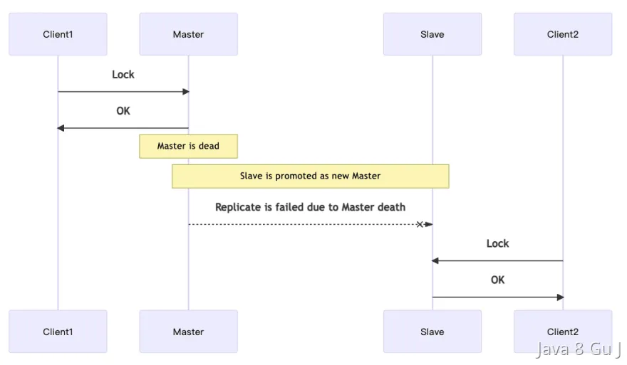

# A线程获取Redis分布式锁,但那一刻做了主从的切换,B线程能获取到锁吗

::: caution
内容来源网络，仅供学习使用。 
**不要相信文档中的链接、联系方式等！！！**
:::

这个问题，其实本质上想问的就是Redis分布式锁的单点问题。

问题是这样的：

当使用集群模式部署的时候，如果master一个客户端在master节点加锁成功了，然后没来得及同步数据到其他节点上，他就挂了， 那么这时候如果选出一个新的节点，再有客户端来加锁的时候，就也能加锁成功，因为数据没来得及同步，新的master会认为这个key是不存在的。

所以，基于以上的情况来说，**A线程获取Redis分布式锁，但那一刻做了主从的切换，B线程能不能获取到锁有以下几种情况：**

**1、如果已完成主从同步，那么B线程无法加锁成功。**

**2、如果未来得及做主从同步，那么B线程可以加锁成功。**

# 扩展知识

### 如何避免单点问题的发生？

[14.Redis_什么是RedLock,他解决了什么问题](../14.Redis/什么是RedLock,他解决了什么问题.md)

## RedLock被废弃

[14.Redis_Redisson_中为什么要废弃_RedLock,该用啥](../14.Redis/Redisson_中为什么要废弃_RedLock,该用啥.md)
