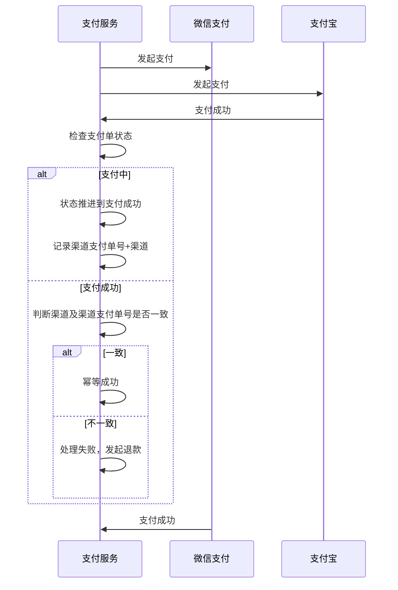
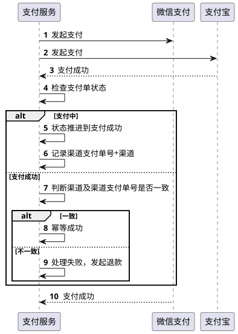

# 一个支付单,多个渠道同时支付成功了怎么办

::: caution
内容来源网络，仅供学习使用。 
**不要相信文档中的链接、联系方式等！！！**
:::

在电商场景中，创建了一个支付单之后，会通过支付工具进行支付，比如微信支付、支付宝、银行卡等，那么在特殊场景中，会出现，用户先通过微信支付尝试支付，因为网络延迟导致一直未支付成功，后面用户又再用支付宝支付成功了，可是过了一会，微信支付那面又回调通知支付成功了，这种该怎么处理呢？

其实，这个问题和之前我们讨论的另一个问题的解决思路差不多，但是也有一定的差别。

[42.场景题_一个订单,在11_00超时关闭,但在11_00也支付成功了,怎么办](./一个订单,在11_00超时关闭,但在11_00也支付成功了,怎么办.md)

要想解决这个问题，首先需要有明确的状态机和支付单状态的流转控制，这个不详细展开了，可以参考上面这个文章。

这个场景存在一个特殊的地方，那就是已经支付成功的单据，下一次支付成功的回调过来的时候，如何做幂等控制。

好的做法是，在支付单中冗余一个支付渠道和渠道支付单号，在支付成功的时候，把支付渠道返回的渠道支付单号记录下来。

在接收到支付成功回调的时候，先检查状态，如果发现已经支付成功，则比对支付渠道和渠道单号是否一致，如果一致，则幂等成功。如果不一致，说明发生了重复支付，则执行退款流程。

冲退的流程及异常情况处理，在上面的链接中也展开讲过，这里不再赘述了。
