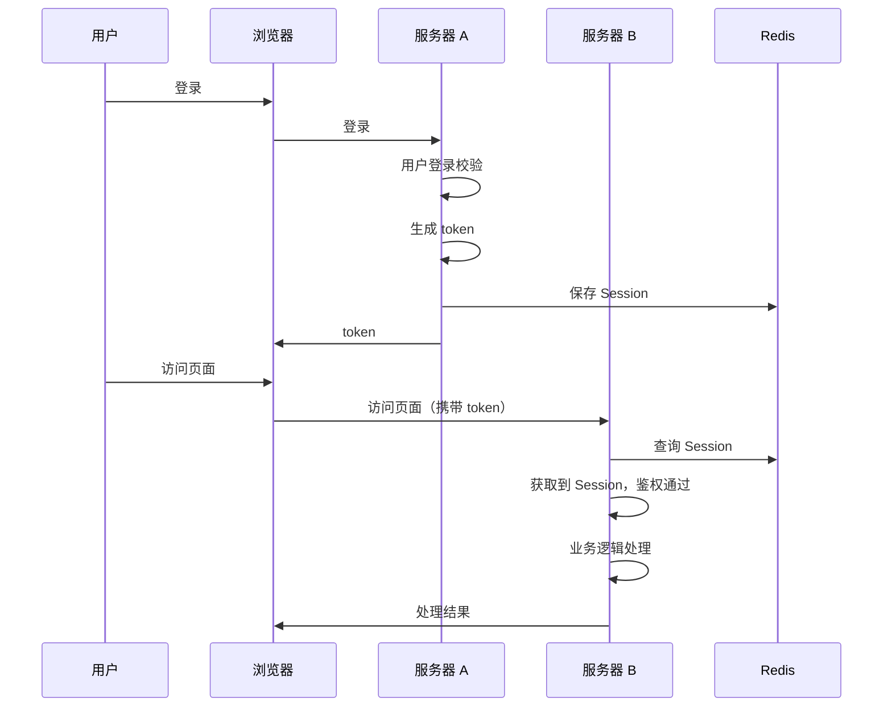
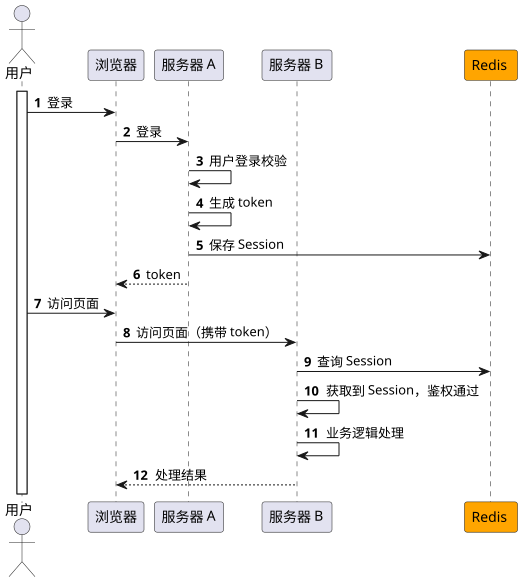

# 分布式系统,用户登录信息保存在服务器A上,服务器B如何获取到共享Session

::: caution
内容来源网络，仅供学习使用。 
**不要相信文档中的链接、联系方式等！！！**
:::

场景题场景题，其实拆解一下就是八股文，这个问题归根结底，问你的就是如何实现分布式Session。

[13.分布式_怎么实现分布式Session](../13.分布式/怎么实现分布式Session.md)

在上面这篇文章中我们介绍了很多分布式 Session的方案，其中**最常用的就是用 Redis 来保存了**。

其实就是把用户的登录信息保存在 Redis 中，然后 A 服务器和 B 服务器都从这个 Redis 中读取 Session。主要的流程如下：

除了用 Redis 以外，还可以用其他的第三方存储，比如MySQL，mongodb，等等的都可以的。

除了用 Redis 以外，还有一些其他方案，在上面的文章中都提到了，就不展开说了，如客户端存储、粘性 Session、Session 复制等等
