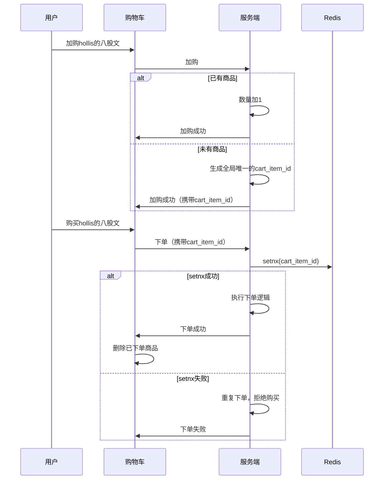
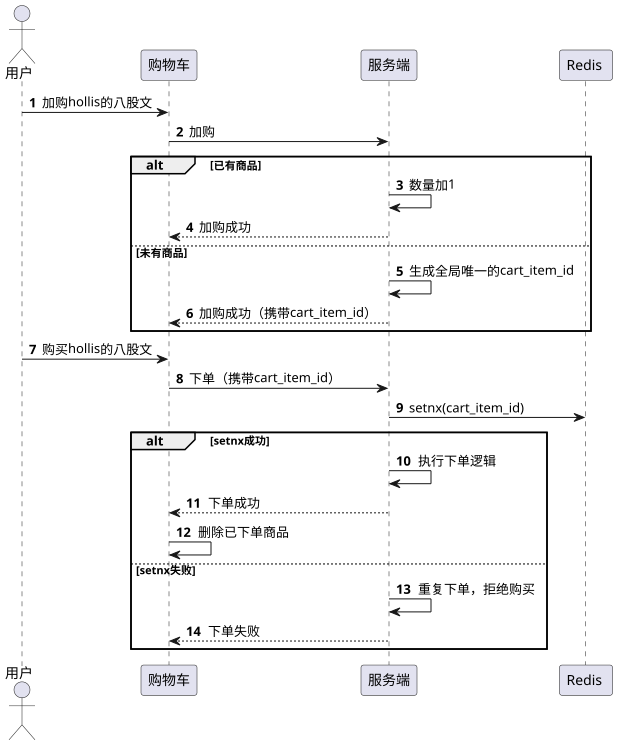

# 购物车中如何解决重复下单的问题

::: caution
内容来源网络，仅供学习使用。 
**不要相信文档中的链接、联系方式等！！！**
:::

[42.场景题_如何解决消息重复消费、重复下单等问题](./如何解决消息重复消费、重复下单等问题.md)

我们前面的题目中介绍过基于token机制来解决重复下单问题的方案。但是这个方案在商品详情页下单是可以用的。，但是如果是购物车下单，就不ok了。

因为前面的方案我们说为了解决用户提前刷一批token的情况，基于"品+用户"的维度生成token，但是在购物车中是有很多品的，用户刚进购物车的时候，你也不知道用户这次要购买的是哪个品。

那怎么办呢？可以参考淘x的方案。那就是每一个商品在加入购物车的时候，都生成一个cart\_item\_id。

这个cart\_item\_id的特点是：

1、全局唯一，所有用户的cart\_item\_id都不一样

2、只有这个sku在首次进入购物车时才生成，如果是已有sku的加购，无需生成，以为这种情况是直接修改数量。

3、如果一个商品在购物车中被购买了之后，再次被加入购物车，则生成新的cart\_item\_id

整个cart\_item\_id的生成和校验逻辑如下：

通过setnx，借助redis来保证只有一个线程可以成功，因为cart\_item\_id是全局唯一的，所以能保证在某个购物车的某个商品，只能被下单成功一次。

后续这个cart\_item\_id可以做个定期清理，或者设置一个失效时间也行（如：`SET cart_item_id cart_item_id NX EX 300` ），这个失效时间其实不用太长，3-5分钟完全够了。

# 扩展知识

## 恶意攻击

上面的方案，能够防止用户的误操作，或者是秒杀时候的重复点击下单按钮的这种重复下单。但是如果是恶意攻击怎么办？会不会有人伪造请求，直接向后端发送下单请求，然后自己伪造一些cart\_item\_id呢，每次都传不一样的，不就绕开了setnx了么

并不会，因为cart\_item\_id是我们生成的，购物车在加购的时候是有后端交互的，这时候是后端生成的这个cart\_item\_id。

这时候下单带过来cart\_item\_id的时候，我们可以先做个校验，确保这个cart\_item\_id是有的，并且是在这个用户的购物车中有的才让他下单就行了。
