# Spring_AI中的advisor机制了解吗

::: caution
内容来源网络，仅供学习使用。<br/>
**不要相信文档中的链接、联系方式等！！！**
:::

（本文内容来自我出的[00.必读_AI课优惠券](../00.必读/AI课优惠券.md)，详细的代码演示和视频讲解可以从课程中学习。）

Spring AI 中提供了一个灵活且强大的方式，可以用于拦截、修改和增强 Spring 应用中的 AI 交互功能，那就是Advisor，通过利用Advisor，开发者可以创建更复杂、可重用且易于维护的 AI 组件。

可以把Advisor理解为插件，比如我们想要实现记忆功能，就可以用到Memory相关的Advisor

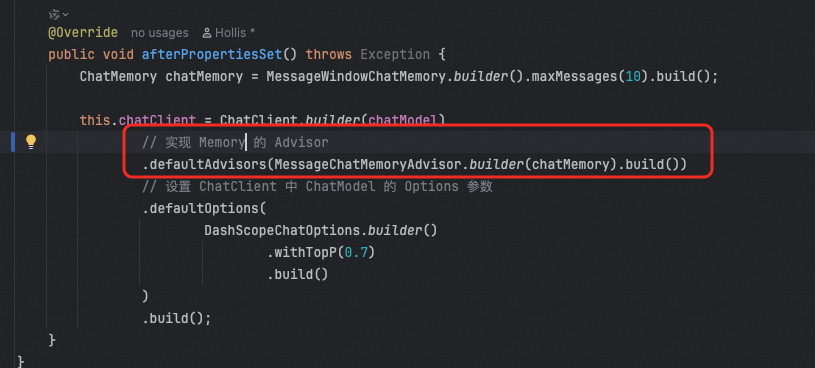

实现日志记录相关的功能，我们就可以添加一个日志的Advisor：

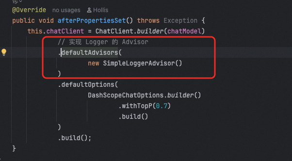

Spring AI中也提供了一些列内置的Advisor

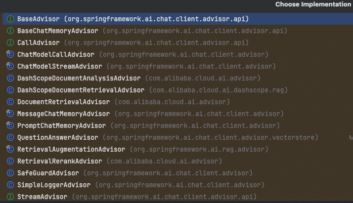

我们看一下Advisor接口的定义，其实没啥东西，主要是他继承自Ordered，需要在他的所有视线中实现`int getOrder();` 这个方法。这个方法主要是用来设置各个Advisor的顺序的。

```plain
public interface Advisor extends Ordered {
    int DEFAULT_CHAT_MEMORY_PRECEDENCE_ORDER = -2147482648;

    String getName();
}
```

他还有几个子接口。主要就是CallAdvisor、StreamAdvisor以及BaseAdvisor。

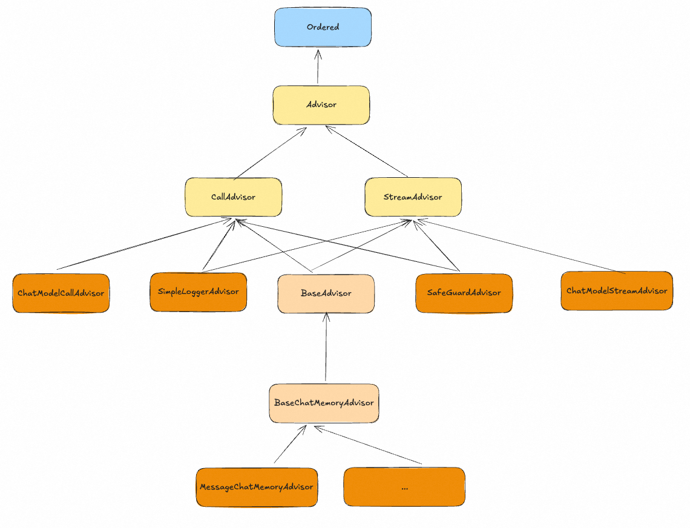

其中最基础的两个接口，一个是CallAdvisor一个是StreamAdvisor，一个是给同步调用使用的，另一个是给流式调用使用的。别贴提供了adviseCall和adviseStream方法。

```plain
public interface CallAdvisor extends Advisor {
    ChatClientResponse adviseCall(ChatClientRequest chatClientRequest, CallAdvisorChain callAdvisorChain);
}

public interface StreamAdvisor extends Advisor {
    Flux<ChatClientResponse> adviseStream(ChatClientRequest chatClientRequest, StreamAdvisorChain streamAdvisorChain);
}
```

其实Advisor的执行过程，就和AOP是一样的，他会把所有注册到一个chatClient上的Advisor都找出来，然后按顺序执行。

在DefaultChatClient中会有一个advisorChain，这里面就是所有注册进来的advisor，以此调用这些advisor的adviseCall方法。（如果是流式调用，就是调用adviseStream方法）

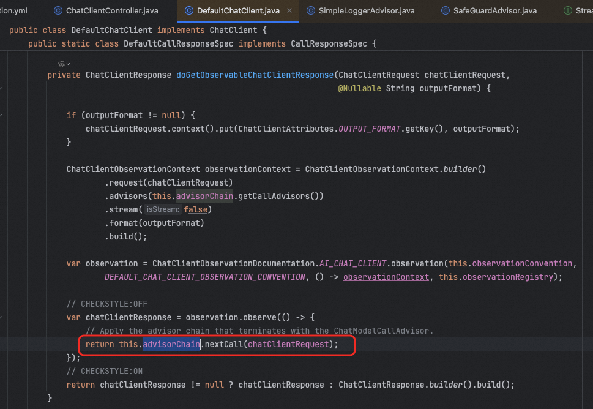

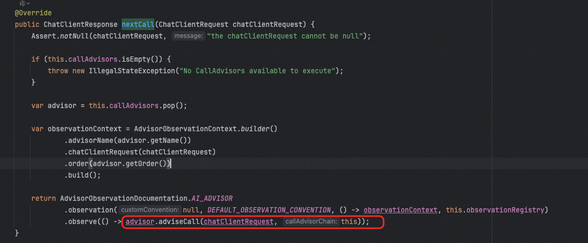

这个adviseCall方法是怎么实现的呢(adviseStream类似，拿adviseCall为例）？其实主要分4类：

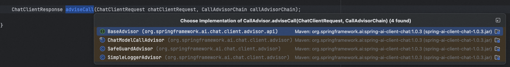

-   ChatModelCallAdvisor
-   SimpleLoggerAdvisor
-   SafeGuardAdvisor
-   BaseAdvisor

### ChatModelCallAdvisor

ChatModelCallAdvisor的adviseCall的实现很简单，就是直接调用chatModel的call方法，可以理解为直接和大模型交互了。

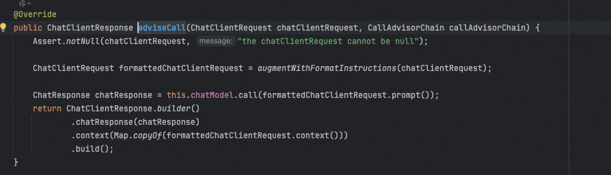

因为直接直接要和大模型交互，其实这个advisor的话理论上应该是最后执行的，所以他的getOrder设置的是最低优先级。

```plain
@Override
public int getOrder() {
    return Ordered.LOWEST_PRECEDENCE;
}
```

### SimpleLoggerAdvisor

这个是一个内置的日志打印的advisor，adviseCall实现如下：

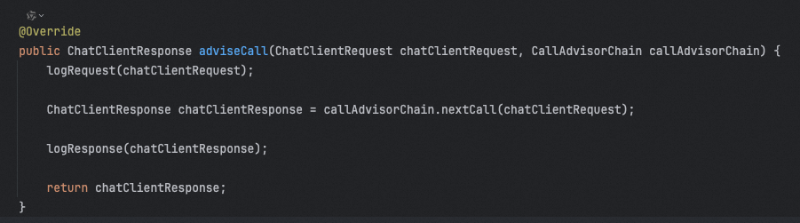

其实就是在调用下一个advisor之前先记录一下request的日志，在调用之后，再记录一下response的日志。

### SafeGuardAdvisor

这是一个spring ai内置的安全审查的advisor，其实主要的实现内容就是做敏感词拦截：

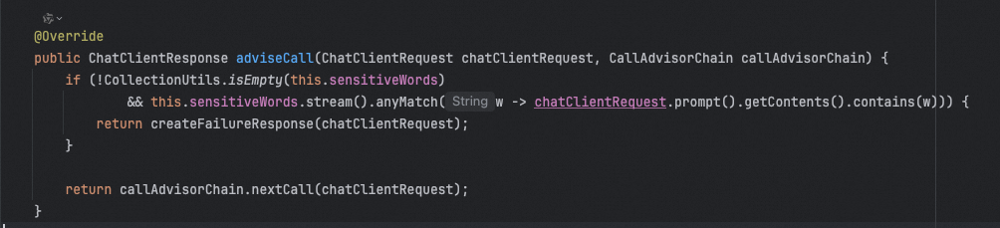

### BaseAdvisor

这个是除了以上几个advisor之外，所有其他advisor的接口，他的实现充分的体现了AOP的机制：

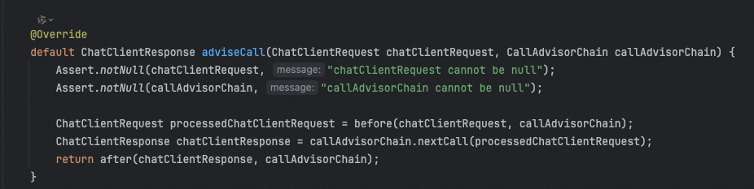

在调用下一个advisor之前，先调用自己的before方法，再调用拿到结果之后，再调用自己的after方法。

那么也就是说，我们可以自定义advisor的话，如果想在模型调用前或者调用后做一些其他事情，都可以实现这个接口，比如我们前面用到过很多次的MessageChatMemoryAdvisor

他的before和after实现如下，就是做记忆的记录。

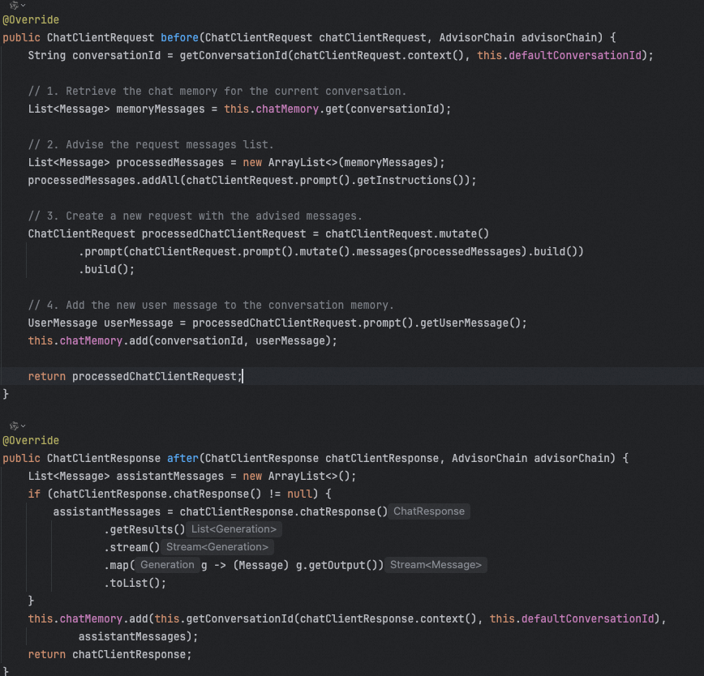

最后，再贴一张spring ai官方给出的advisor的调用流程图：

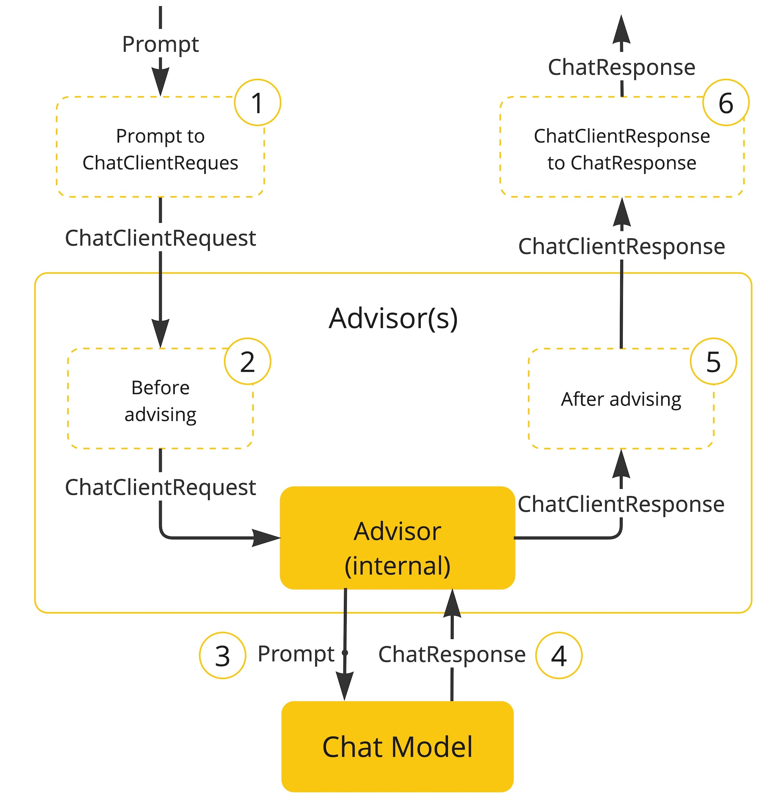
